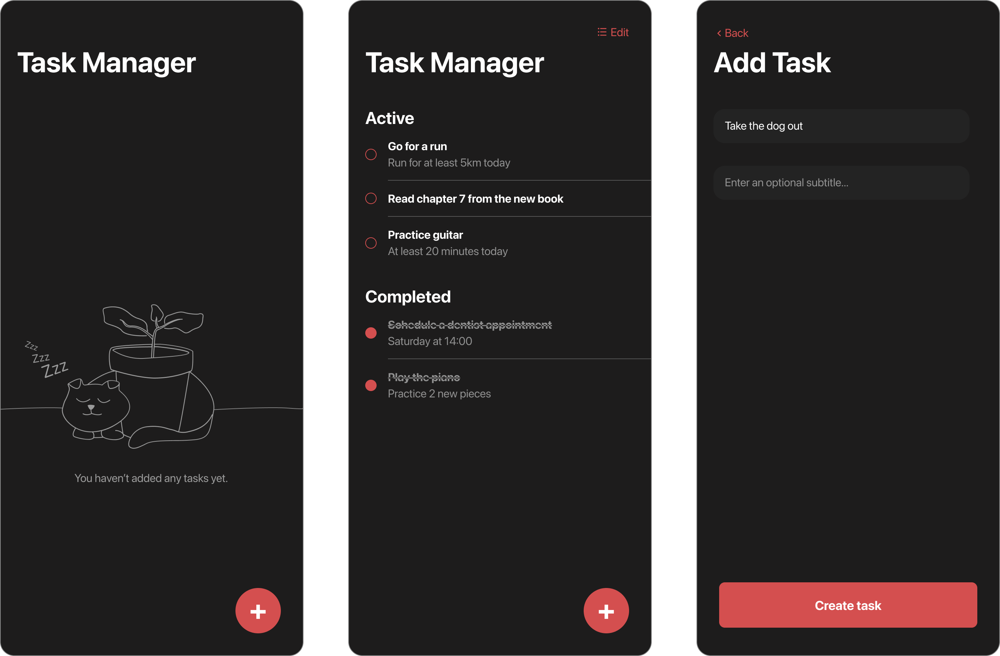

# 2. An overview of Task Manager

*Task Manager* is a simple offline-only application used for - you guessed it - task management.



Each task is represented with the following structure:

```swift
/// A representation of a task.
struct TaskItem {

	/// The title of the task.
	let title: String

	/// An optional subtitle associated with the task.
	let subtitle: String?

	/// Specifies whether the task is completed or not.
	let isCompleted: Bool
}
```

When users tap on *“Create task”*, a new `TaskItem` is being created and added to the task list as such:

```swift
func onCreateTask() {

		// 1. Create a new task
		let newTask = TaskItem(
			title: title,
			subtitle: subtitle,
			isCompleted: false
		)

		// 2. Append it to the existing task list
		applicationState.tasks.appendItem(newTask)
}
```

Everything works great, but there’s a slight problem. The moment the users close and reopen the app, their entire task list is reset. This is because there is no persistence solution added at the moment, and this is what we’re going to add in the following chapters.
