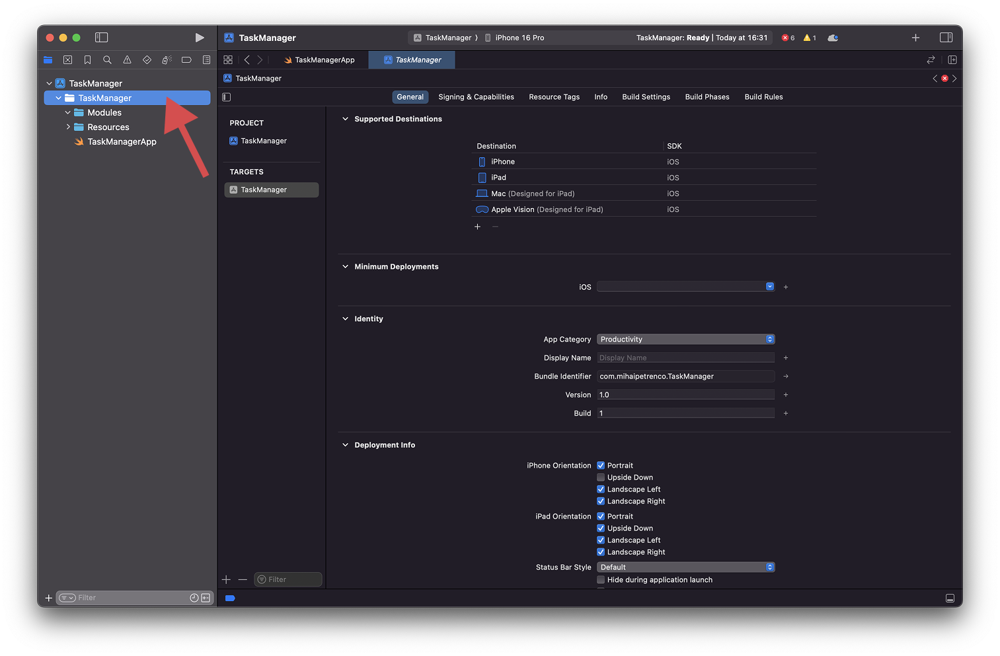
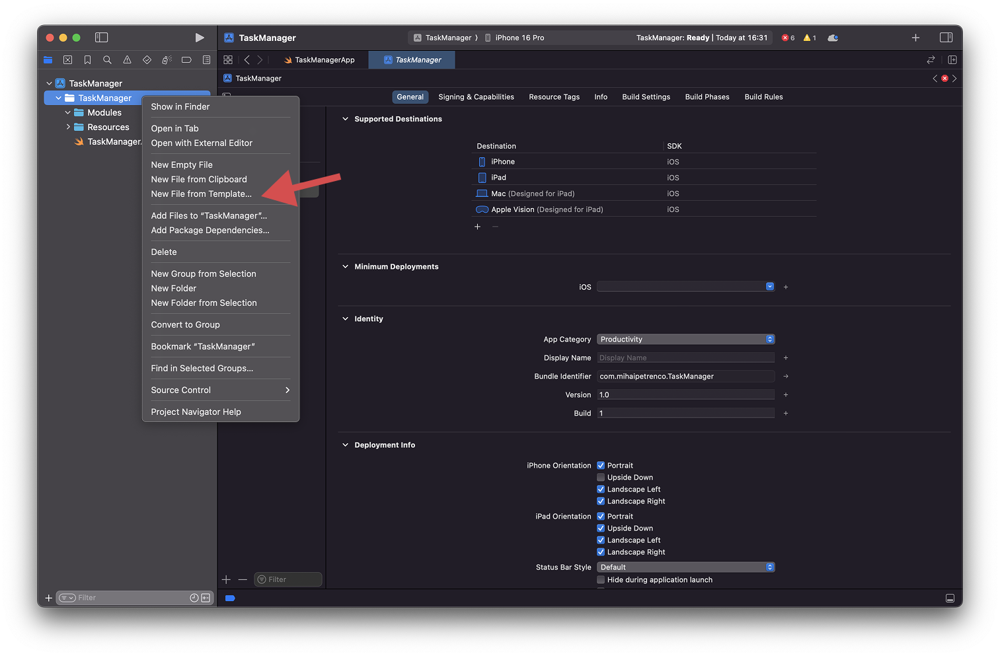
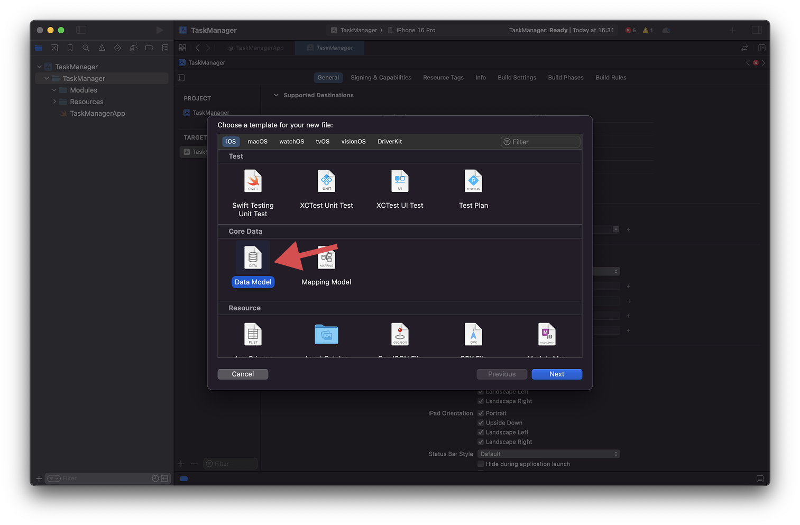
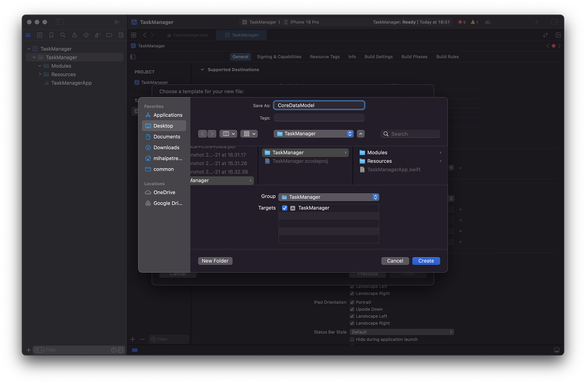
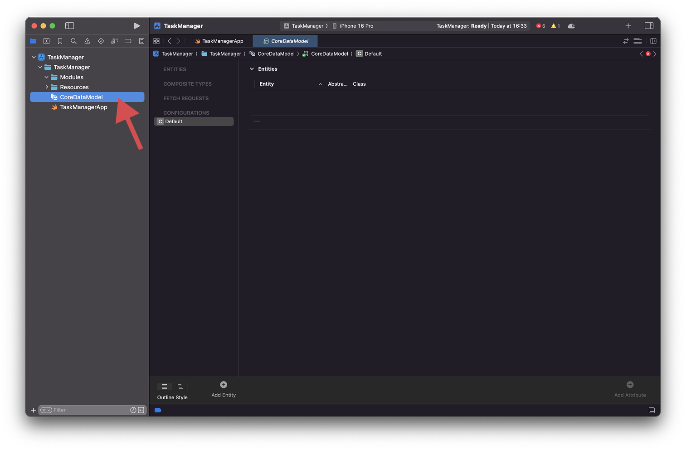

# 3. Adding the Core Data model

Let’s start by adding a *Data Model* to our project. The model allows us to define our entities, properties and relationships in a visual manner. Select the project folder in the Project Navigator and right click:

Select *“New File from Template…”* from the menu:

From the templates, select *Data Model* from the list:

Enter a name for your data model. There is no particular naming convention here. You can use *“Model”* or *“CoreDataModel”*, or even use the name of the app *“TaskManager”*. Once done, click on `Create`.

This will add a new Core Data model to our project. If we tap on it, we will see the visual editor, where we can start adding entities and related details:

