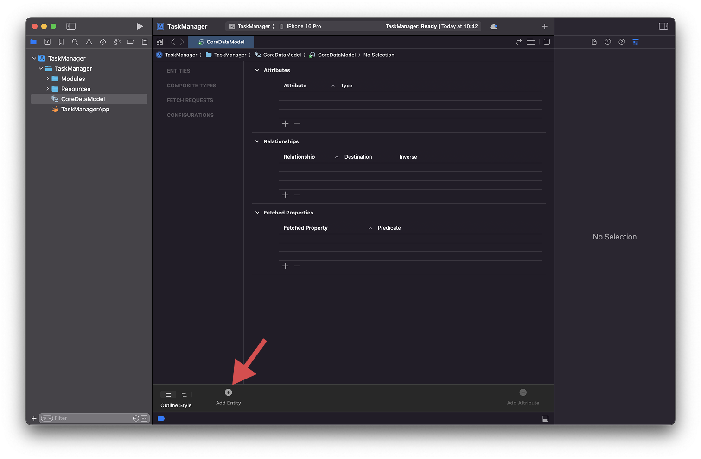
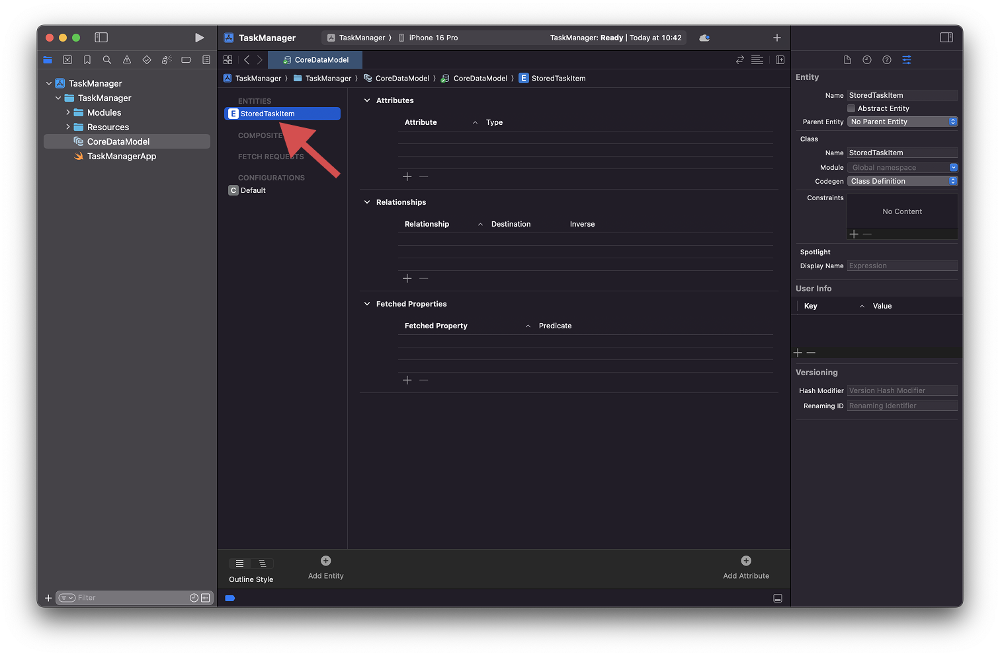
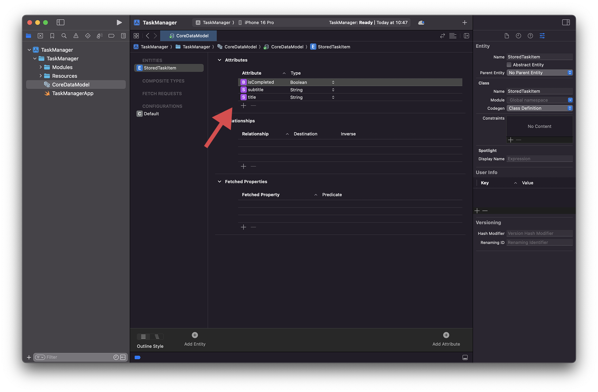
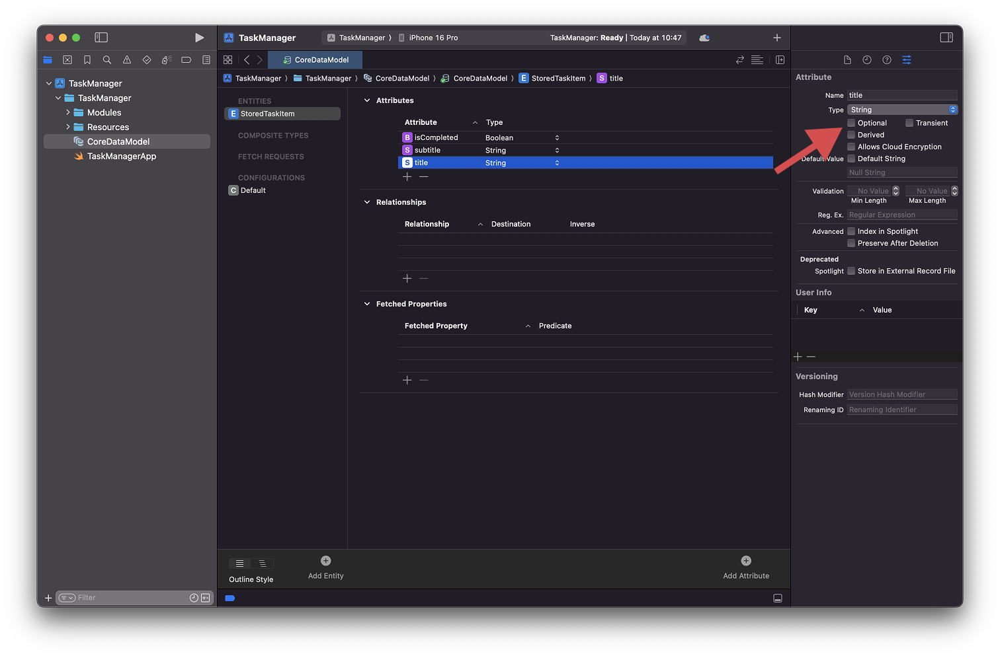

# 4. Creating our first Entity

In the overview chapter, we took a look at the `TaskItem` structure:

```swift
/// A representation of a task.
struct TaskItem {

	/// The title of the task.
	let title: String

	/// An optional subtitle associated with the task.
	let subtitle: String?

	/// Specifies whether the task is completed or not.
	let isCompleted: Bool
}
```

In order to persist this data, we must create a Core Data entity with the same properties. Start by tapping the `Add Entity` button at the bottom of the screen:



This will create a new entity, which will be visible on the left side of the model editor. I like to differentiate between `TaskItem` and my Core Data entity by adding a “*Stored”* prefix - `StoredTaskItem`.



With our entity created, let’s add the necessary attributes.



We created the same attributes as our structure and assigned to appropriate type:

- `isCompleted`: a property of type `Boolean`;
- `subtitle`: a property of type `String`;
- `title`: a property of type `String`;

Finally, since we know that `title` and `isCompleted` are both required properties, we should uncheck the `Optional` property from both:



<aside>
💬

Note that Core Data’s `Optional` and Swift optionals are completely different things. Core Data is a technology way older than Swift. Basically, the way optionals in Core Data work is that if you try to save an entity without first setting all the non-optional properties, the save will fail and an exception will be thrown.

</aside>

With this in mind, our basic entity structure is done. Our next step is to initialize Core Data and use our newly created entity in code.
